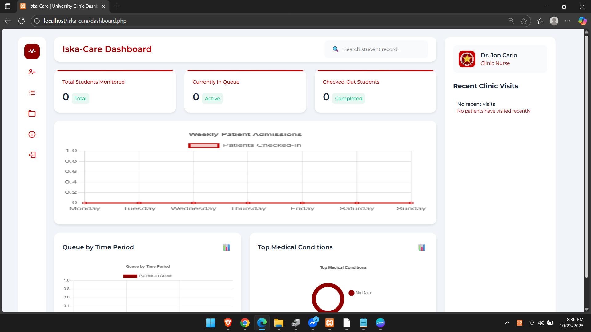

<h1 align="center">Iska-Care</h1>

<em>Modern care for the modern Iskolar ng Bayan</em>

---

## 🩺 Project Overview
**Iska-Care** is a modern web-based patient management system designed to help clinics and school health units manage student medical records efficiently.  
It provides a smooth and organized way to handle patient data while maintaining a clean, user-friendly dashboard.

---

## 📸 Screenshots

  

  

---

## ⚙️ Features

- ➕ **Add Patient** – Quickly register new patients into the system.  
- ⏰ **Check Out** – Mark patients as checked out with one click.  
- 🔁 **Queue System** – Automatically manages active and checked-out patients.  
- ❌ **Delete Function** – Remove records easily when needed.  
- 📊 **Statistical Graphs** – View summarized patient statistics through modern, dynamic charts.  
- 🧭 **Modern Interface** – Clean, minimalist design inspired by professional health dashboards.

---

## 👥 Contributors

- 🧑‍💻 **Jon Carlo** – *Full Stack Developer*  
- 💻 **Gian** – *Back-End Developer*  
- 💻 **Xezar** – *Back-End Developer*  

---

## 🧪 Beta Phase Notice

🚧 **Iska-Care is currently in its Beta Phase.**  
Please note:
- Some parts of the UI are still under development.  
- **Mobile devices are not yet supported.**  
- Minor bugs or incomplete features may still appear.  

We appreciate your understanding and support as we continue improving Iska-Care for the modern Iskolar ng Bayan. ❤️

---

© 2025 Iska-Care | Developed for Data Structures and Algorithms Project

